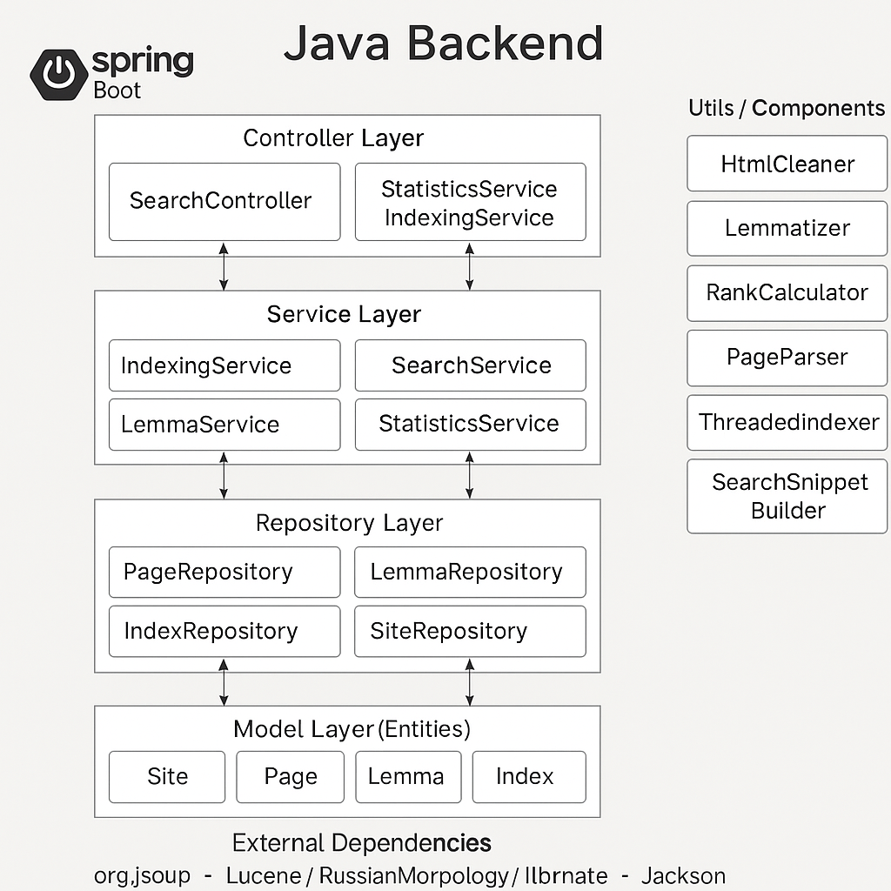

# Search Engine


Поисковой движок на Java с использованием Spring Boot, поддерживающий многопоточный обход сайтов, индексацию страниц, лемматизацию и полнотекстовый поиск.

##  Возможности

- Многопоточный обход сайтов
- Парсинг HTML (Jsoup)
- Индексация и хранение данных в PostgreSQL
- Морфологический анализ с использованием Lucene
- REST API для управления поиском и индексацией
- Асинхронная обработка и логирование

##  Технологии

- Java 17
- Spring Boot
- Maven
- Docker + Docker Compose
- PostgreSQL
- Jsoup
- Lucene
- Lombok
- Hibernate

##  Установка и запуск

1. Клонируйте проект:

   ```bash
   git clone https://github.com/workjava9/Search_Engine.git
   cd Search_Engine
   
2. Соберите проект:
    
   ```bash
    mvn clean install

3. Запустите Docker Compose:
   
   ```bash 
   docker-compose up --build
   
       
        
                                                            
                                                           Архитектура проекта: 
